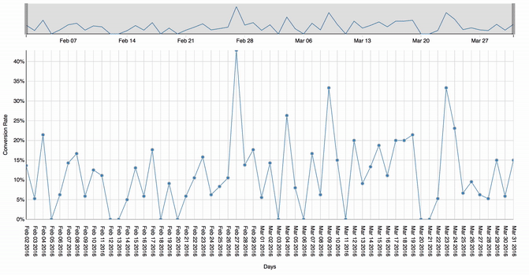

**Time Granulariry Animation in D3**
This is a project demonstrating time granularity animation based on [the React tutorial](https://github.com/reactjs/react-tutorial) and d3 animation and brush feature.



# Installation

### Node

```sh
npm install
node server.js
```

And visit <http://localhost:3000/>.
